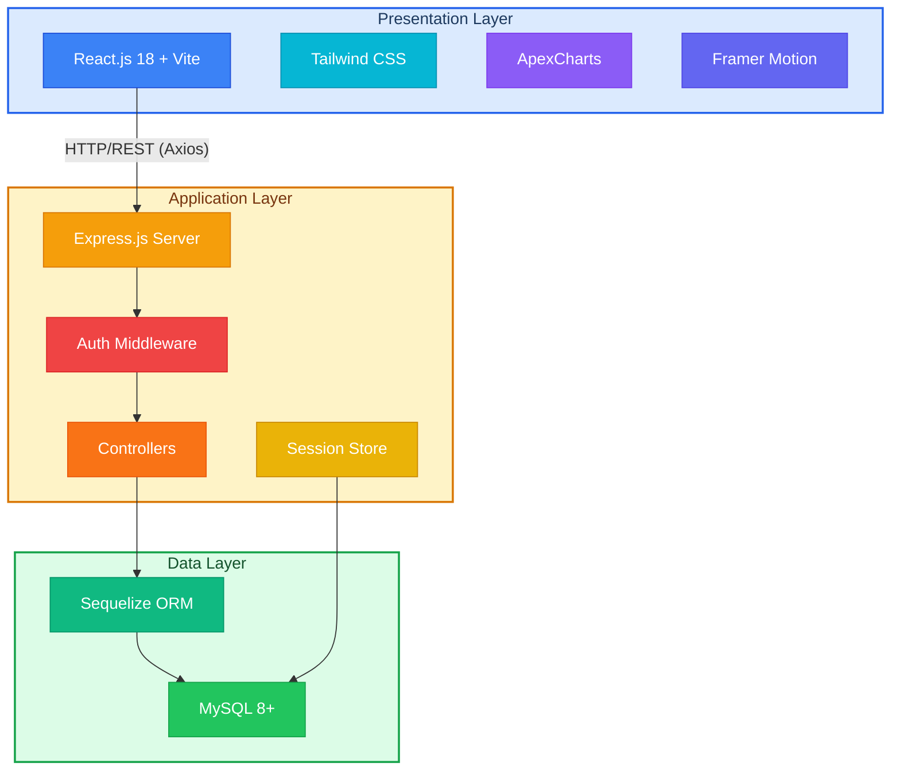
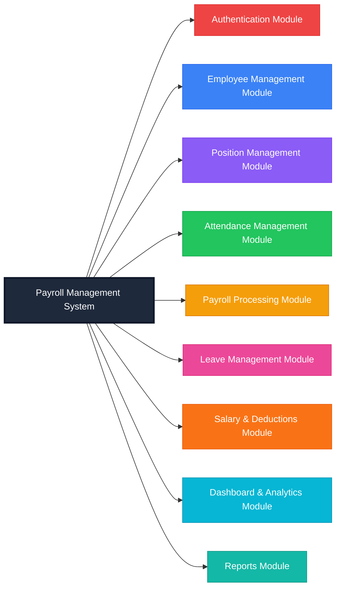
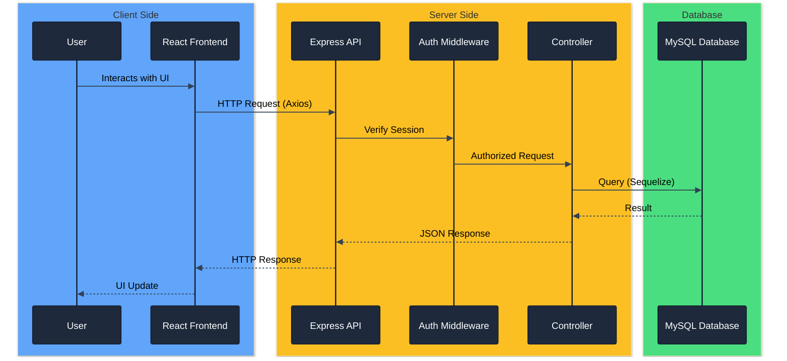
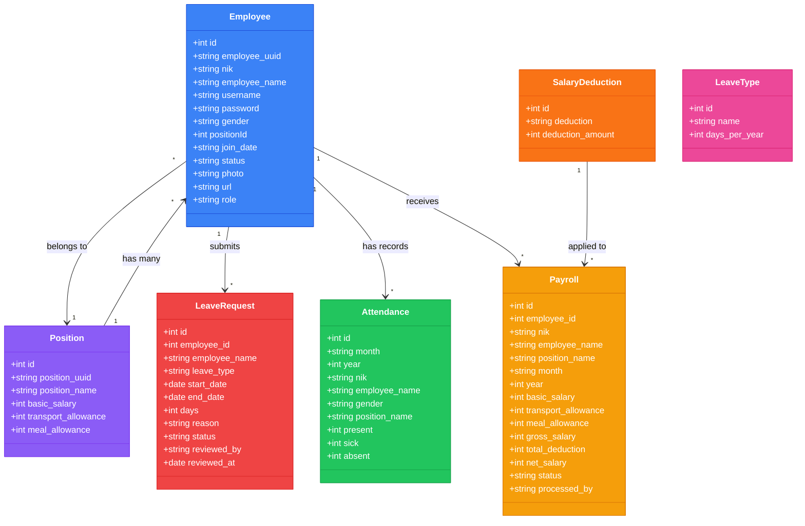
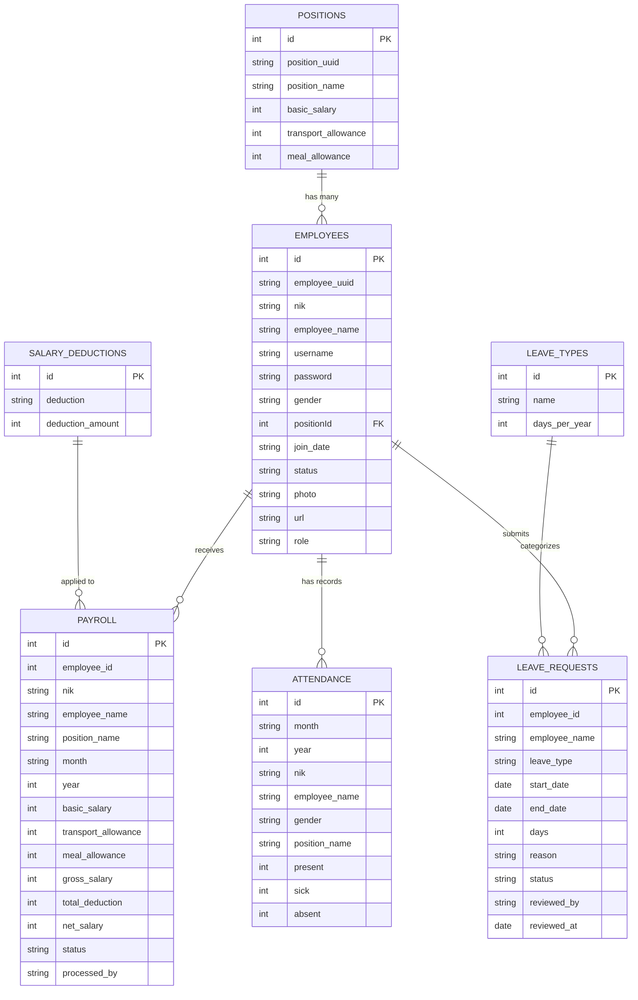
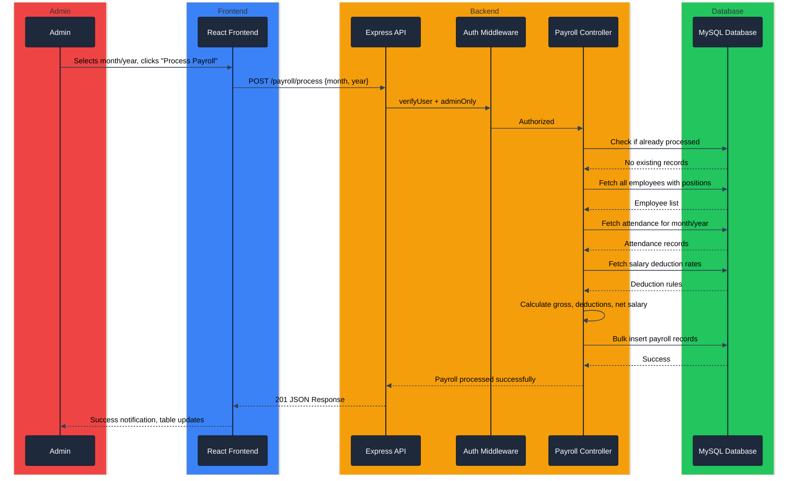
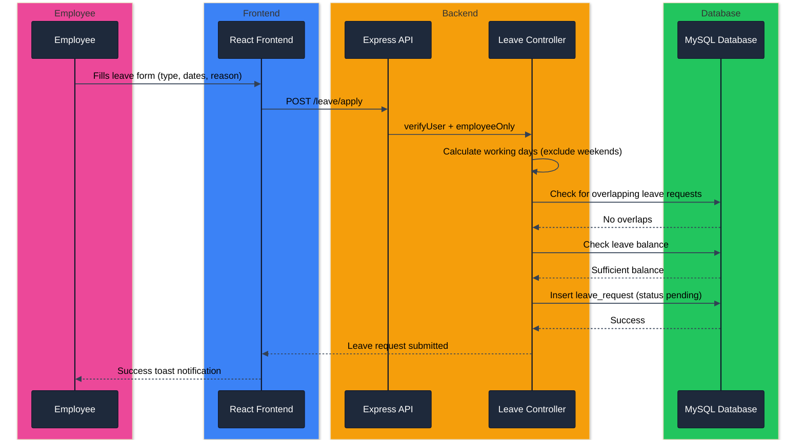

# MIS LAB EXPERIMENT NO. 10

| Name | Registration ID |
|------|-----------------|
| Paras Churi | 221070017 |
| Ariv Fernandes | 221070019 |
| Tanay Gada | 221070020 |

---

## Aim

Carry out Software Design for the Payroll Management System (PMS) using Object-Oriented Design methodology.

---

## Introduction

Software Design is the process of transforming requirements into a blueprint for system development. Object-Oriented Design (OOD) focuses on defining system components (classes), their interactions, and architecture.

For the Payroll Management System, the design ensures modularity, scalability, and maintainability of the system. The PMS enables organizations to manage employee records, track attendance, process payroll with automated salary calculations, handle leave requests, and generate reports — all through a role-based web interface for administrators and employees.

---

## Design Approach

The system follows Object-Oriented Design with:

- Modular architecture with separation of frontend and backend
- Separation of concerns (Presentation, Business Logic, Data Access)
- Reusable components on both frontend (React) and backend (Express controllers)
- Role-Based Access Control (RBAC) for Admin and Employee portals
- Scalable design with RESTful API architecture
- MVC (Model-View-Controller) pattern on the backend

---

## System Architecture

### 3-Tier Architecture

**1. Presentation Layer (Frontend)**
- React.js 18 with Vite
- Tailwind CSS for styling
- ApexCharts for data visualization
- Framer Motion for animations
- Axios for HTTP communication

**2. Application Layer (Backend)**
- Node.js with Express.js
- RESTful API endpoints
- Session-based authentication with Argon2 hashing
- Middleware for authorization (verifyUser, adminOnly, employeeOnly)
- Business logic in controllers

**3. Data Layer (Database)**
- MySQL 8+ relational database
- Sequelize ORM for data modeling
- Session store using connect-session-sequelize

### Architecture Diagram



---

## High-Level Design (HLD)

### Major Modules



| Module | Description |
|--------|-------------|
| Authentication | Login, logout, session management, password change, RBAC |
| Employee Management | CRUD operations for employee records with photo upload |
| Position Management | CRUD for positions/designations with salary configuration |
| Attendance Management | Monthly attendance tracking, analytics, and reporting |
| Payroll Processing | Automated salary calculation, deductions, payslip generation |
| Leave Management | Leave requests, approvals, balance tracking, leave types |
| Salary & Deductions | Configurable deduction rules (absent, sick, etc.) |
| Dashboard & Analytics | Real-time statistics and visual summaries |
| Reports | Salary reports, attendance reports, payslips |

### Data Flow

```
User → React Frontend → Axios HTTP Request → Express Backend API → Auth Middleware → Controller → Sequelize ORM → MySQL Database → Response → UI Update
```



---

## Low-Level Design (LLD)

### Class Design

#### Employee Class

| Attribute | Type | Constraints |
|-----------|------|-------------|
| id | INTEGER | Primary Key, Auto Increment |
| employee_uuid | STRING | UUID v4, Not Null |
| nik | STRING(16) | Not Null (Employee ID) |
| employee_name | STRING(100) | Not Null |
| username | STRING(120) | Not Null |
| password | STRING | Argon2 Hashed |
| gender | STRING(15) | Not Null |
| positionId | INTEGER | Foreign Key → positions.id |
| join_date | STRING | Not Null |
| status | STRING(50) | Not Null |
| photo | STRING(100) | Not Null |
| url | STRING | Auto-generated URL |
| role | STRING | Not Null ("admin" or "employee") |

#### Position Class

| Attribute | Type | Constraints |
|-----------|------|-------------|
| id | INTEGER | Primary Key, Auto Increment |
| position_uuid | STRING | UUID v4, Not Null |
| position_name | STRING(120) | Not Null |
| basic_salary | INTEGER(50) | Not Null |
| transport_allowance | INTEGER(50) | Not Null |
| meal_allowance | INTEGER(50) | — |

#### Attendance Class

| Attribute | Type | Constraints |
|-----------|------|-------------|
| id | INTEGER(11) | Primary Key, Auto Increment |
| month | STRING(15) | Not Null |
| year | INTEGER | Not Null |
| nik | STRING(16) | Not Null |
| employee_name | STRING(100) | Not Null |
| gender | STRING(20) | — |
| position_name | STRING(50) | — |
| present | INTEGER(11) | Days present |
| sick | INTEGER(11) | Sick days |
| absent | INTEGER(11) | Absent days |

#### Payroll Class

| Attribute | Type | Constraints |
|-----------|------|-------------|
| id | INTEGER | Primary Key, Auto Increment |
| employee_id | INTEGER | Not Null |
| nik | STRING(16) | Not Null |
| employee_name | STRING(100) | Not Null |
| position_name | STRING(50) | Not Null |
| month | STRING(15) | Not Null |
| year | INTEGER | Not Null |
| basic_salary | INTEGER | Default 0 |
| transport_allowance | INTEGER | Default 0 |
| meal_allowance | INTEGER | Default 0 |
| gross_salary | INTEGER | Default 0 |
| present_days | INTEGER | Default 0 |
| sick_days | INTEGER | Default 0 |
| absent_days | INTEGER | Default 0 |
| absent_deduction | INTEGER | Default 0 |
| sick_deduction | INTEGER | Default 0 |
| total_deduction | INTEGER | Default 0 |
| net_salary | INTEGER | Default 0 |
| status | STRING(20) | Default "processed" |
| processed_by | STRING(100) | — |

#### SalaryDeduction Class

| Attribute | Type | Constraints |
|-----------|------|-------------|
| id | INTEGER(11) | Primary Key, Auto Increment |
| deduction | STRING(120) | Not Null |
| deduction_amount | INTEGER(11) | Not Null |

#### LeaveType Class

| Attribute | Type | Constraints |
|-----------|------|-------------|
| id | INTEGER | Primary Key, Auto Increment |
| name | STRING(50) | Not Null, Unique |
| days_per_year | INTEGER | Not Null, Default 0 |

#### LeaveRequest Class

| Attribute | Type | Constraints |
|-----------|------|-------------|
| id | INTEGER | Primary Key, Auto Increment |
| employee_id | INTEGER | Not Null |
| employee_name | STRING(100) | Not Null |
| leave_type | STRING(50) | Not Null |
| start_date | DATEONLY | Not Null |
| end_date | DATEONLY | Not Null |
| days | INTEGER | Not Null (Working days) |
| reason | TEXT | Not Null |
| status | STRING(20) | Default "pending" |
| reviewed_by | STRING(100) | — |
| reviewed_at | DATE | — |

### Class Diagram



---

## Module Design

### Authentication Module
- Login with username/password (Argon2 verification)
- Session creation and management (express-session + SequelizeStore)
- Logout (session destruction)
- Password change with current password verification
- Middleware: `verifyUser` (session check), `adminOnly`, `employeeOnly`

### Employee Management Module
- Add new employee with photo upload (PNG/JPG/JPEG, max 2MB)
- Update employee details (with optional password and photo change)
- Delete employee (with photo cleanup from filesystem)
- View all employees with position details (via JOIN)
- View single employee by ID

### Position Management Module
- Add position with salary configuration (basic, transport, meal allowances)
- Update position details
- Delete position
- List all positions

### Attendance Management Module
- Record monthly attendance per employee (present, sick, absent days)
- Duplicate detection (same employee + month + year)
- Analytics endpoint with year-based trends
- Filterable by year, month, and employee

### Payroll Processing Module
- Calculate gross salary = basic + transport allowance + meal allowance
- Calculate deductions = (absent days x absent rate) + (sick days x sick rate)
- Calculate net salary = gross - total deductions
- Batch process payroll for all employees for a given month/year
- Prevent duplicate processing for same month/year
- Mark payroll as paid

### Leave Management Module
- Submit leave request with type, date range, and reason
- Working days calculation (excludes weekends)
- Overlap detection for existing leave requests
- Admin review (approve/reject with remarks)
- Leave balance tracking per employee per year
- Pre-seeded leave types: Annual (12), Sick (10), Personal (5), Maternity (90), Paternity (5)

### Salary & Deductions Module
- Configurable deduction types (absent, sick, late, etc.)
- CRUD operations for deduction rules
- Applied during payroll processing

### Dashboard Module
- Admin: total employees, positions, attendance records, monthly payroll stats
- Employee: personal salary, attendance, and leave summaries

---

## Database Design (MySQL Tables)

### Entity-Relationship Diagram



### Tables

| Table | Purpose |
|-------|---------|
| employees | Employee records with credentials and role |
| positions | Job designations with salary structure |
| attendance | Monthly attendance records per employee |
| salary_deductions | Configurable deduction rules |
| payroll | Processed salary records |
| leave_types | Available leave categories with annual allocation |
| leave_requests | Employee leave applications and status |
| sessions | Server-side session storage (auto-managed) |

---

## Interface Design

### User Interfaces

**Admin Portal:**
- Login Page
- Dashboard (statistics, charts)
- Employee Management (list, add/edit forms)
- Position Management (list, add/edit forms)
- Attendance Data (list with filters)
- Salary Deduction Settings (list, add/edit forms)
- Salary Data (monthly view)
- Payroll Processing (process, view records)
- Leave Management (review requests)
- Reports (salary, attendance, payslip, attendance analytics)
- Settings (change password)

**Employee Portal:**
- Login Page
- Dashboard (personal summary)
- My Salary Data (salary history)
- My Attendance (attendance records)
- My Leave (submit requests, view balance)
- Settings (change password)

### API Endpoints

| Method | Path | Description |
|--------|------|-------------|
| POST | `/login` | Authenticate user |
| GET | `/me` | Get current user |
| DELETE | `/logout` | Destroy session |
| PATCH | `/change-password` | Change password |
| GET | `/employees` | List all employees |
| GET | `/employees/:id` | Get employee by ID |
| POST | `/employees` | Create employee |
| PATCH | `/employees/:id` | Update employee |
| DELETE | `/employees/:id` | Delete employee |
| GET | `/positions` | List all positions |
| POST | `/positions` | Create position |
| PATCH | `/positions/:id` | Update position |
| DELETE | `/positions/:id` | Delete position |
| GET | `/attendance` | List attendance records |
| GET | `/attendance/analytics` | Attendance trends |
| POST | `/attendance` | Create attendance record |
| PATCH | `/attendance/update/:id` | Update attendance |
| DELETE | `/attendance/:id` | Delete attendance |
| GET | `/salary-deductions` | List deductions |
| POST | `/salary-deductions` | Create deduction |
| PATCH | `/salary-deductions/:id` | Update deduction |
| DELETE | `/salary-deductions/:id` | Delete deduction |
| GET | `/salary/report` | Salary report |
| GET | `/salary/slip/:id` | Individual payslip |
| GET | `/salary/my-history` | Employee salary history |
| GET | `/dashboard/stats` | Dashboard statistics |
| GET | `/my/profile` | Employee self profile |
| GET | `/my/attendance` | Employee self attendance |
| POST | `/payroll/process` | Process payroll |
| GET | `/payroll/records` | List payroll records |
| GET | `/payroll/status` | Payroll status check |
| PATCH | `/payroll/mark-paid` | Mark payroll as paid |
| GET | `/leave/types` | List leave types |
| POST | `/leave/apply` | Submit leave request |
| GET | `/leave/my-requests` | Employee leave history |
| GET | `/leave/my-balance` | Employee leave balance |
| GET | `/leave/requests` | Admin view all requests |
| PATCH | `/leave/review/:id` | Approve/reject leave |

---

## Sequence Design

### Example: Payroll Processing Flow



### Example: Leave Request Flow



---

## Component Design

### Frontend Components

```mermaid
graph TD
    App["App.jsx"]
    App --> Routes["Routes/index.jsx"]
    Routes --> AdminLayout["Admin Layout"]
    Routes --> EmployeeLayout["Employee Layout"]

    AdminLayout --> AdminDashboard["Dashboard"]
    AdminLayout --> EmployeeMgmt["Employee Management"]
    AdminLayout --> PositionMgmt["Position Management"]
    AdminLayout --> AttendanceData["Attendance Data"]
    AdminLayout --> SalaryDeductions["Salary Deductions"]
    AdminLayout --> SalaryData["Salary Data"]
    AdminLayout --> PayrollProcessing["Payroll Processing"]
    AdminLayout --> LeaveManagement["Leave Management"]
    AdminLayout --> Reports["Reports"]
    AdminLayout --> AdminSettings["Settings"]

    Reports --> SalaryReport["Salary Report"]
    Reports --> AttendanceReport["Attendance Report"]
    Reports --> Payslip["Payslip"]
    Reports --> AttendanceAnalytics["Attendance Analytics"]

    EmployeeLayout --> EmpDashboard["Dashboard"]
    EmployeeLayout --> EmpSalary["My Salary"]
    EmployeeLayout --> EmpAttendance["My Attendance"]
    EmployeeLayout --> EmpLeave["My Leave"]
    EmployeeLayout --> EmpSettings["Settings"]

    style App fill:#1e293b,stroke:#0f172a,color:#ffffff,stroke-width:3px
    style Routes fill:#475569,stroke:#334155,color:#ffffff

    style AdminLayout fill:#2563eb,stroke:#1d4ed8,color:#ffffff,stroke-width:2px
    style AdminDashboard fill:#3b82f6,stroke:#2563eb,color:#ffffff
    style EmployeeMgmt fill:#3b82f6,stroke:#2563eb,color:#ffffff
    style PositionMgmt fill:#3b82f6,stroke:#2563eb,color:#ffffff
    style AttendanceData fill:#3b82f6,stroke:#2563eb,color:#ffffff
    style SalaryDeductions fill:#3b82f6,stroke:#2563eb,color:#ffffff
    style SalaryData fill:#3b82f6,stroke:#2563eb,color:#ffffff
    style PayrollProcessing fill:#3b82f6,stroke:#2563eb,color:#ffffff
    style LeaveManagement fill:#3b82f6,stroke:#2563eb,color:#ffffff
    style Reports fill:#6366f1,stroke:#4f46e5,color:#ffffff
    style AdminSettings fill:#3b82f6,stroke:#2563eb,color:#ffffff

    style SalaryReport fill:#8b5cf6,stroke:#7c3aed,color:#ffffff
    style AttendanceReport fill:#8b5cf6,stroke:#7c3aed,color:#ffffff
    style Payslip fill:#8b5cf6,stroke:#7c3aed,color:#ffffff
    style AttendanceAnalytics fill:#8b5cf6,stroke:#7c3aed,color:#ffffff

    style EmployeeLayout fill:#059669,stroke:#047857,color:#ffffff,stroke-width:2px
    style EmpDashboard fill:#10b981,stroke:#059669,color:#ffffff
    style EmpSalary fill:#10b981,stroke:#059669,color:#ffffff
    style EmpAttendance fill:#10b981,stroke:#059669,color:#ffffff
    style EmpLeave fill:#10b981,stroke:#059669,color:#ffffff
    style EmpSettings fill:#10b981,stroke:#059669,color:#ffffff
```



### Backend Components

```mermaid
graph TD
    Server["index.js - Express Server"]
    Server --> Middleware["Middleware"]
    Server --> RouteLayer["Routes"]
    Server --> Models["Models - Sequelize"]

    Middleware --> AuthUser["AuthUser.js"]
    AuthUser --> verifyUser["verifyUser()"]
    AuthUser --> adminOnly["adminOnly()"]
    AuthUser --> employeeOnly["employeeOnly()"]

    RouteLayer --> AuthRoute["AuthRoute"]
    RouteLayer --> UserRoute["UserRoute"]
    RouteLayer --> PositionRoute["PositionRoute"]
    RouteLayer --> AttendanceRoute["AttendanceRoute"]
    RouteLayer --> SalaryRoute["SalaryRoute"]
    RouteLayer --> PayrollRoute["PayrollRoute"]
    RouteLayer --> LeaveRoute["LeaveRoute"]
    RouteLayer --> DashboardRoute["DashboardRoute"]

    AuthRoute --> AuthCtrl["Auth Controller"]
    UserRoute --> EmpCtrl["Employee Controller"]
    PositionRoute --> PosCtrl["Position Controller"]
    AttendanceRoute --> AttCtrl["Transaction Controller"]
    SalaryRoute --> SalCtrl["Salary Controller"]
    PayrollRoute --> PayCtrl["Payroll Controller"]
    LeaveRoute --> LeaveCtrl["Leave Controller"]
    DashboardRoute --> DashCtrl["Dashboard Controller"]

    Models --> EmployeeModel["Employee"]
    Models --> PositionModel["Position"]
    Models --> AttendanceModel["Attendance"]
    Models --> PayrollModel["Payroll"]
    Models --> SalaryDeductionModel["SalaryDeduction"]
    Models --> LeaveTypeModel["LeaveType"]
    Models --> LeaveRequestModel["LeaveRequest"]

    style Server fill:#1e293b,stroke:#0f172a,color:#ffffff,stroke-width:3px

    style Middleware fill:#ef4444,stroke:#dc2626,color:#ffffff,stroke-width:2px
    style AuthUser fill:#f87171,stroke:#ef4444,color:#ffffff
    style verifyUser fill:#fca5a5,stroke:#f87171,color:#7f1d1d
    style adminOnly fill:#fca5a5,stroke:#f87171,color:#7f1d1d
    style employeeOnly fill:#fca5a5,stroke:#f87171,color:#7f1d1d

    style RouteLayer fill:#f59e0b,stroke:#d97706,color:#ffffff,stroke-width:2px
    style AuthRoute fill:#fbbf24,stroke:#f59e0b,color:#78350f
    style UserRoute fill:#fbbf24,stroke:#f59e0b,color:#78350f
    style PositionRoute fill:#fbbf24,stroke:#f59e0b,color:#78350f
    style AttendanceRoute fill:#fbbf24,stroke:#f59e0b,color:#78350f
    style SalaryRoute fill:#fbbf24,stroke:#f59e0b,color:#78350f
    style PayrollRoute fill:#fbbf24,stroke:#f59e0b,color:#78350f
    style LeaveRoute fill:#fbbf24,stroke:#f59e0b,color:#78350f
    style DashboardRoute fill:#fbbf24,stroke:#f59e0b,color:#78350f

    style AuthCtrl fill:#3b82f6,stroke:#2563eb,color:#ffffff
    style EmpCtrl fill:#3b82f6,stroke:#2563eb,color:#ffffff
    style PosCtrl fill:#3b82f6,stroke:#2563eb,color:#ffffff
    style AttCtrl fill:#3b82f6,stroke:#2563eb,color:#ffffff
    style SalCtrl fill:#3b82f6,stroke:#2563eb,color:#ffffff
    style PayCtrl fill:#3b82f6,stroke:#2563eb,color:#ffffff
    style LeaveCtrl fill:#3b82f6,stroke:#2563eb,color:#ffffff
    style DashCtrl fill:#3b82f6,stroke:#2563eb,color:#ffffff

    style Models fill:#22c55e,stroke:#16a34a,color:#ffffff,stroke-width:2px
    style EmployeeModel fill:#4ade80,stroke:#22c55e,color:#14532d
    style PositionModel fill:#4ade80,stroke:#22c55e,color:#14532d
    style AttendanceModel fill:#4ade80,stroke:#22c55e,color:#14532d
    style PayrollModel fill:#4ade80,stroke:#22c55e,color:#14532d
    style SalaryDeductionModel fill:#4ade80,stroke:#22c55e,color:#14532d
    style LeaveTypeModel fill:#4ade80,stroke:#22c55e,color:#14532d
    style LeaveRequestModel fill:#4ade80,stroke:#22c55e,color:#14532d
```



---

## Design Constraints

- Must support role-based access (Admin and Employee portals with enforced authorization)
- Must ensure secure authentication using Argon2 password hashing
- Must handle concurrent users with session-based auth and rate limiting
- Must validate all inputs (file type/size for uploads, required fields, password matching)
- Must be scalable — adding new modules should not require restructuring existing code
- Must support relational data integrity (foreign keys between positions and employees)
- Must generate printable reports (salary, attendance, payslips) with proper formatting

---

## Design Principles Used

- **Modularity** — Each feature (employees, positions, payroll, leave) is a separate module with its own model, controller, and route
- **Encapsulation** — Business logic is contained within controllers; models define data structure only
- **Separation of Concerns** — Frontend handles presentation, backend handles logic, database handles storage
- **Reusability** — Shared middleware (verifyUser, adminOnly) reused across all protected routes; shared UI components (layouts, sidebar)
- **Scalability** — New modules (payroll, leave) added without modifying existing code
- **Single Responsibility** — Each controller function handles one operation; each route file maps to one resource
- **DRY (Don't Repeat Yourself)** — Common patterns extracted into middleware and helper functions

---

## Conclusion

The Software Design of the Payroll Management System provides a structured blueprint for system implementation using Object-Oriented Design principles. By defining the 3-tier system architecture, seven major modules, detailed class designs with attributes and relationships, comprehensive API endpoints, and interaction sequences, the design ensures scalability, maintainability, and efficient development.

The use of MVC architecture, role-based access control, relational database design with foreign key constraints, and modular component structure establishes a strong foundation for a production-ready payroll system. The design supports all critical payroll operations — employee management, attendance tracking, automated salary calculation with configurable deductions, leave management, and comprehensive reporting — while maintaining clear separation of concerns and extensibility for future enhancements.
